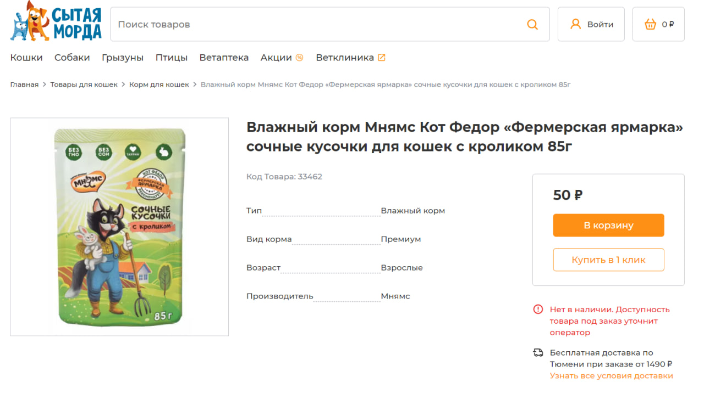
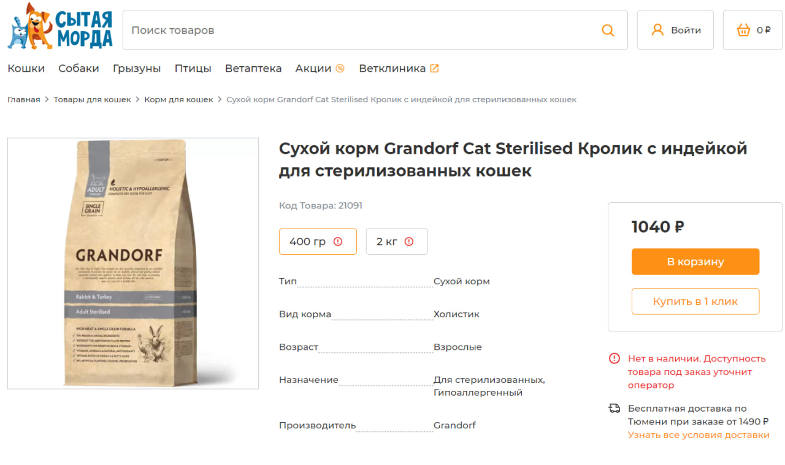
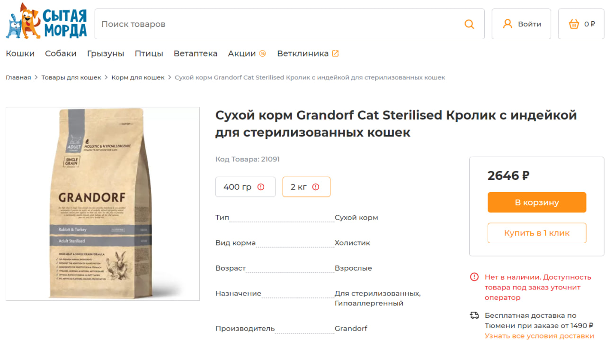

# Morda Site Parsing and JSON Data Extraction

## Описание проекта

Проект предназначен для парсинга данных с общедоступного сайта [morda72](https://morda72.ru) с использованием **BeautifulSoup** и **Selenium**, а также автоматического занесения данных о товарах в формате **JSON**.

**BeautifulSoup** используется для парсинга статического контента сайта, в то время как **Selenium** применяется для получения данных из динамически загружаемых элементов, недоступных через bs4.


##### *(Текущий код парсит лишь первую и последнюю категорию, первую и последнюю подкатегорию, первую и последнюю сраниц(page) и первый и последний товар для упрощения. В самом коде описываеться как можно разширить парс кода на все доступные товарые за пару кликов)
## Вид

#### Пример страницы с которой парситься товар




## Структура парсинга

### Домашние питомцы на сайте morda72.ru

На сайте [morda72](https://morda72.ru) представлены товары для следующих домашних питомцев:

- Кошки
- Собаки
- Грызуны
- Птицы
- Рыбы
- Прочие животные

### Иерархия категорий и подкатегорий

Каждая категория содержит множество подкатегорий. Структура парсинга выглядит следующим образом:

- **Категория**
  - **Подкатегория**
    - **Список товаров(множество pages)**
      - **Продукт**

Скрипт настроен на выборочные категории и подкатегории для демонстрации возможностей, но может быть легко адаптирован для полного парсинга всех доступных категорий на сайте.

## Собираемая информация

Скрипт собирает следующую информацию о товарах:

- **Название товара (`title`)** – Название товара.
- **Изображение (`image`)** – Локальный путь к сохраненному изображению товара.
- **Код товара (`code`)** – Уникальный код товара.
- **Атрибуты (`attributes`)** – Дополнительные характеристики товара в виде словаря(количество атрибутов варьируется в зависимости от товара).
  - **Тип(`type`)** – Тип товара.
  - **Вид корма(`kind`)** – Вид товара.
  - **Возраст(`age`)** – Возрастная категория, для которой предназначен товар.
  - **Назначение(`purpose`)** – Назначение товара.
  - **Пол(`genger`)** – Пол, для которого предназначен товар.
  - **Производитель(`maker`)** – Производитель товара.
- **Описание (`description`)** – Полное текстовое описание товара.
- **Теги (`tags`)** – Список тегов, связанных с товаром.
- **Варианты цен по весу (`weight_prices`)** – Список вариантов цены товара в зависимости от веса или объема. Каждый вариант включает:
  - **Вес (`weight`)** – Значение веса или объема.
  - **Цена (`price`)** – Цена за соответствующий вес.
  - **Наличие (`available`)** – Информация о доступности товара.

#### Сам selenium используеться лишь в тех моментах когда это крайне необходимо: только когда у товара есть несколько весов и соответсвующие им цены
<div>
  
  
</div>

## Структура JSON файла

Собранные данные сохраняются в файле `scraped_data.json` в следующей иерархической структуре:

- **data** (список категорий)
  - **Категория**
    - **name**: название категории
    - **subcategories** (список подкатегорий)
      - **Подкатегория**
        - **name**: название подкатегории
        - **products** (список товаров)
          - **Товар**
            - **title**: название товара
            - **image**: имя файла изображения
            - **href**: ссылка на страницу товара
            - **code**: код товара
            - **attributes**: словарь дополнительных характеристик(количество атрибутов варьируется в зависимости от товара)
              - **type**: тип
              - **kind**: вид
              - **age**: возраст
              - **purpose**: назначение
              - **genger**: пол
              - **maker**: производитель
            - **description**: описание товара
            - **tags**: список тегов
            - **weight_prices** (список вариантов цен)
              - **Вариант цены**
                - **weight**: вес или объем
                - **price**: цена
                - **available**: наличие

## Пример структуры данных

Ниже приведен пример записи товара в формате JSON:

```json
{
    "title": "Влажный корм Мнямс Кот Федор «Фермерская ярмарка» сочные кусочки  для кошек с кроликом 85г",
    "image": "Влажный корм Мнямс Кот Федор «Фермерская ярмарка» сочные кусочки  для кошек с кроликом 85г.svg",
    "code": "33462",
    "attributes": {
        "Тип": "Влажный корм",
        "Вид корма": "Премиум",
        "Возраст": "Взрослые",
        "Производитель": "Мнямс"
    },
    "description": "Влажный корм \"Фермерская ярмарка\" линии Кот Федор - это сбалансированный рацион, который обязательно понравится вашей кошке...",
    "tags": [
        "мнямс",
        "для кошек"
    ],
    "weight_prices": [
        {
            "weight": null,
            "price": "50",
            "available": true
        }
    ]
}
